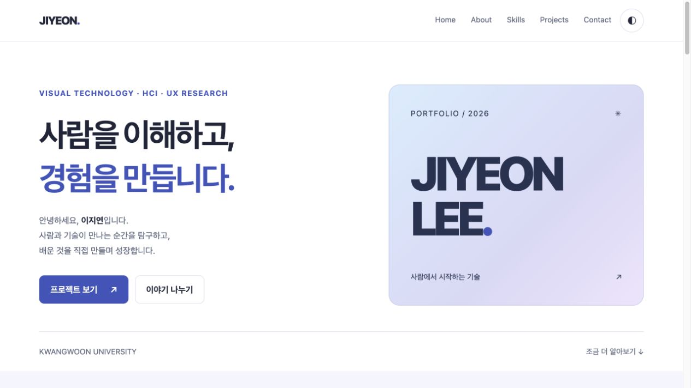
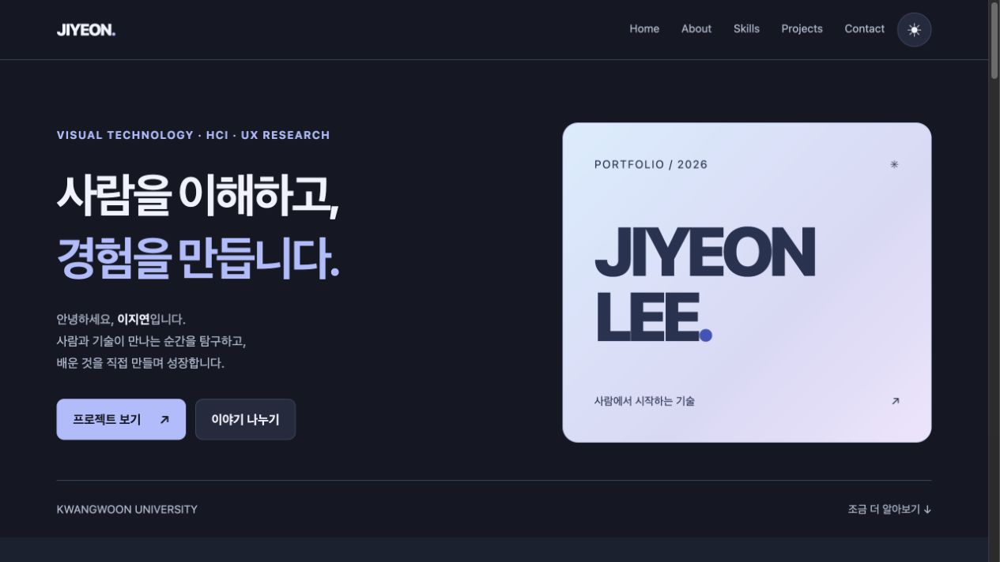
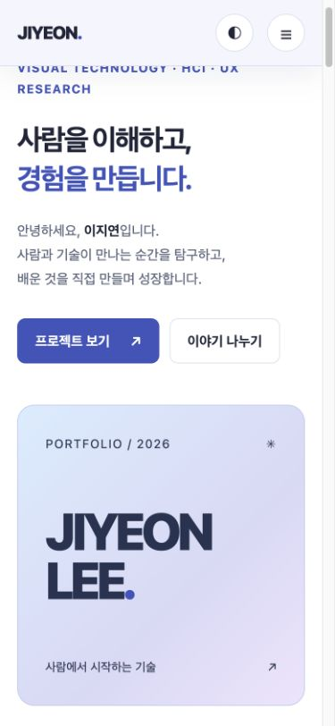

# JIYEON LEE — Portfolio

HTML · CSS · Vanilla JavaScript로 만든 개인 포트폴리오. 프레임워크와 빌드 도구 없이 동작하며, **이벤트 → 상태 변경 → 화면 업데이트** 흐름을 코드로 따라갈 수 있게 구성했습니다.

[포트폴리오 보기](https://bborang.github.io/codyssey-B1-1/) · [저장소](https://github.com/bborang/codyssey-B1-1)

## 미리보기

| 라이트 모드 | 다크 모드 |
| --- | --- |
|  |  |




## 프로젝트 구조

```text
.
├── index.html
├── css/
│   └── style.css
├── js/
│   └── main.js
├── images/
│   ├── profile.svg
│   └── screenshots/
│       ├── desktop.png
│       ├── dark.png
│       └── mobile.png
├── .vscode/
│   └── extensions.json
├── .gitignore
└── README.md
```

각 파일은 다음 역할을 담당합니다.

| 파일 | 역할 |
| --- | --- |
| `index.html` | 페이지 콘텐츠와 시맨틱 구조 |
| `css/style.css` | 색상, 테마, 레이아웃, 반응형 스타일 |
| `js/main.js` | 상태 관리, 이벤트, DOM 업데이트, API 요청, 폼 검증 |
| `images/` | 프로필 이미지와 README용 스크린샷 |

HTML은 페이지의 구조, CSS는 화면 표현, JavaScript는 사용자와 상호작용하는 동작을 담당하도록 분리했습니다.

## 페이지 구성

- **Hero:** 인사말과 주요 이동 버튼
- **About:** 자기소개, 관심 분야, 활동 및 수상 이력
- **Skills:** 언어, 프론트엔드, 데이터, 인프라 및 디자인 도구
- **Projects:** GitHub API로 불러온 공개 저장소
- **Contact:** 이름, 이메일, 메시지 입력 폼
- **Footer:** 저작권, GitHub 및 LinkedIn 링크

페이지 구조에는 `header`, `nav`, `main`, `section`, `article`, `footer` 등의 시맨틱 태그를 사용했습니다. 콘텐츠의 역할이 없는 레이아웃 묶음에는 `div`를 사용했습니다.

## 핵심 구현

### 반응형 레이아웃

모바일 화면을 기본으로 작성하고 화면이 넓어질 때 레이아웃을 확장하는 모바일 퍼스트 방식을 사용했습니다.

| 화면 너비 | 주요 변화 |
| --- | --- |
| 767px 이하 | 한 열 레이아웃, 햄버거 메뉴 |
| 768px 이상 | Hero·About·Contact 다중 열, 가로 네비게이션 |
| 1024px 이상 | Skills 4열, 콘텐츠 간격 확대 |

한 방향으로 요소를 정렬하는 네비게이션과 버튼 영역에는 Flexbox를 사용했습니다. 행과 열을 함께 구성해야 하는 Hero, About 및 카드 목록에는 Grid를 사용했습니다.

프로젝트 카드는 화면 너비에 따라 열 개수가 자동으로 바뀝니다.

```css
.projects-grid {
  display: grid;
  grid-template-columns:
    repeat(auto-fit, minmax(min(100%, 280px), 1fr));
}
```

### CSS 변수와 다크 모드

색상, 간격, 모서리 반경, 그림자 등 반복되는 디자인 값을 `:root`의 CSS 변수로 관리합니다.

```css
:root {
  --color-bg: #ffffff;
  --color-text: #202538;
  --color-primary: #4054bc;
}

[data-theme="dark"] {
  --color-bg: #141824;
  --color-text: #f0f2fc;
  --color-primary: #b0bcff;
}
```

JavaScript는 루트 요소의 `data-theme` 값만 변경합니다. 실제 색상 변경은 CSS가 담당합니다.

선택한 테마는 Local Storage에 저장하고 페이지를 다시 열 때 복원합니다. 브라우저에서 저장소 접근을 제한하더라도 현재 화면의 테마 전환은 계속 동작하도록 예외를 처리했습니다.

### 이벤트와 상태 관리

HTML의 인라인 이벤트 속성 대신 JavaScript에서 `addEventListener`를 사용합니다.

인터랙션은 다음 흐름으로 구성했습니다.

```text
사용자 이벤트
    ↓
상태 변경
    ↓
렌더링 함수 호출
    ↓
DOM 업데이트
```

기능의 성격에 따라 상태를 세 객체로 구분했습니다.

```js
const state = {
  menuOpen: false,
  theme: "light",
  scrolled: false,
  showTopButton: false,
};

const projectState = {
  status: "idle",
  repos: [],
  error: "",
};

const formState = {
  errors: {},
  success: false,
};
```

| 상태 객체 | 관리하는 내용 |
| --- | --- |
| `state` | 메뉴, 테마, 스크롤 상태 |
| `projectState` | API 요청 상태, 저장소 목록, 오류 메시지 |
| `formState` | 입력 필드 오류와 검증 성공 여부 |

상태를 변경하는 코드와 DOM을 수정하는 렌더링 코드를 구분하여 같은 상태가 항상 같은 화면으로 표현되도록 구성했습니다.

다크 모드의 동작 흐름은 다음과 같습니다.

```text
테마 버튼 클릭
    ↓
state.theme 변경
    ↓
renderTheme() 호출
    ↓
data-theme와 버튼 상태 변경
    ↓
Local Storage에 테마 저장
```

### GitHub API

다음 GitHub API에서 공개 저장소를 수정일 순서로 불러옵니다.

```text
GET https://api.github.com/users/bborang/repos?sort=updated&per_page=100
```

API 요청에는 `fetch`, `async/await`, `try/catch`를 사용했습니다.

```text
loadProjects()
    ↓
loading 상태 표시
    ↓
GitHub API 요청
    ↓
HTTP 응답 및 데이터 형식 검사
    ├── 저장소 있음 → success
    ├── 저장소 없음 → empty
    └── 요청 실패 → error
    ↓
상태에 맞는 화면 렌더링
```

`fetch`는 403이나 404와 같은 HTTP 오류에서도 응답 객체를 반환하기 때문에 `response.ok`를 별도로 검사합니다.

요청이 15초 안에 완료되지 않으면 `AbortController`로 중단합니다. GitHub API 호출 제한과 관련된 403·429 응답에는 별도의 안내 메시지를 표시합니다.

| 상태 | 표시 내용 |
| --- | --- |
| `loading` | 프로젝트를 불러오는 중이라는 안내 |
| `success` | 저장소 프로젝트 카드 |
| `empty` | 표시할 프로젝트가 없다는 안내 |
| `error` | 오류 안내와 재시도 버튼 |

API에서 받은 저장소 배열은 `map()`을 사용해 카드 HTML로 변환합니다.

```text
저장소 객체 배열
    ↓
map()
    ↓
프로젝트 카드 문자열 배열
    ↓
join("")
    ↓
프로젝트 목록에 렌더링
```

각 저장소에서 이름, 설명, 언어, 스타 수를 구조분해 할당으로 추출합니다. 외부 데이터는 HTML 이스케이프 처리 후 화면에 삽입합니다.

언어별 프로젝트 필터링은 선택 기능이므로 현재 프로젝트에는 포함하지 않았습니다.

### 폼 유효성 검사

Contact 폼은 다음 항목을 검사합니다.

- 이름, 이메일, 메시지의 빈 값
- 공백만 입력된 값
- 이메일 형식

`input` 이벤트가 발생하면 해당 필드의 오류를 갱신합니다. `submit` 이벤트에서는 `preventDefault()`로 페이지 새로고침을 막고 모든 필드를 다시 검사합니다.

오류가 있으면 각 입력 필드 아래에 메시지를 표시하고 첫 번째 오류 필드로 포커스를 이동합니다. 모든 검사를 통과하면 입력 확인 메시지를 표시합니다.

### 스크롤 인터랙션

| 기능 | 기준 |
| --- | --- |
| 헤더 스타일 변경 | 스크롤 60px 이상 |
| 맨 위로 버튼 표시 | 스크롤 300px 이상 |
| 등장 애니메이션 | 요소가 20% 이상 보이는 시점 |
| 앵커 이동 | CSS `scroll-behavior: smooth` |
| 고정 헤더 보정 | `scroll-margin-top` |

등장 애니메이션에는 Intersection Observer를 사용합니다. 한 번 표시된 요소는 관찰을 해제하여 불필요한 처리를 줄였습니다.

사용자가 운영체제에서 모션 감소를 설정한 경우 애니메이션과 부드러운 스크롤을 생략합니다.
